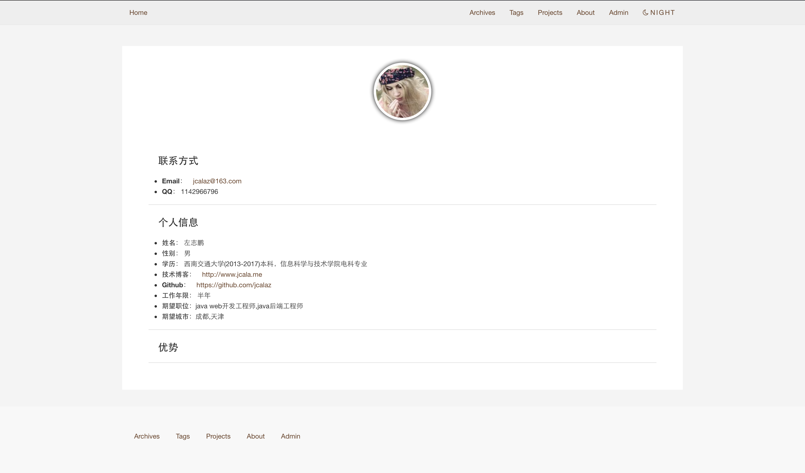
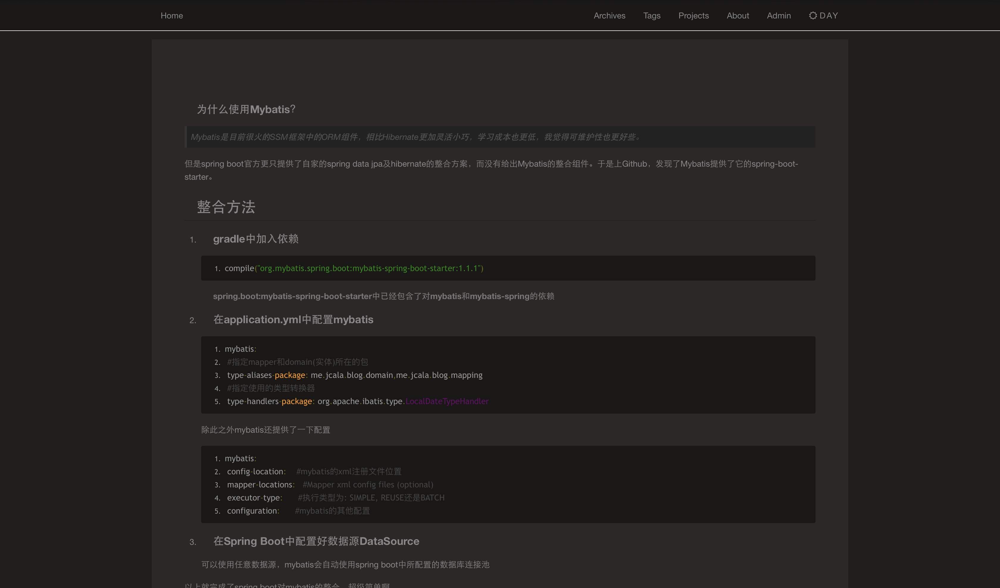
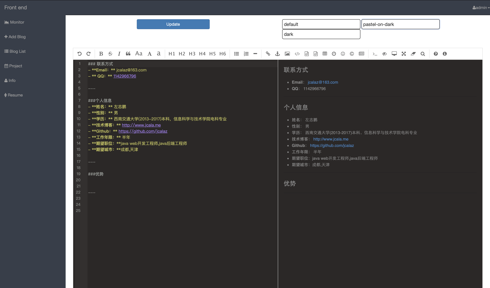
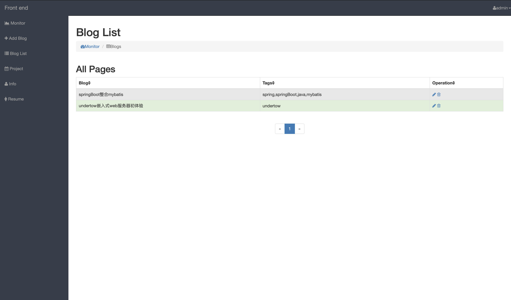

[github地址](https://github.com/jcalaz/jcalaBlog)
## jcalaBlog个人博客网站
#### 所用技术:
 - springBoot 
 - springMVC: MVC框架
 - undertow: web容器
 - mybatis: ORM框架
 - velocity: 模板引擎
 - lombok: 工具
 - quartz: 定时任务
 - ehcache: 缓存
 - bootstrap: css/html框架
 - [editor.md: markdown编辑器](https://github.com/pandao/editor.md)
 - mysql:数据库
---
#### 预览

---
##### 一键黑夜模式

---
##### 后台管理

#### 注意事项
1. 运行后中文显示乱码:在linux下,vim /etc/mysql/my.cnf 。在[mysqld]下添加character-set-server=utf8
2. 二次开发报错,没有getter,setter等方法:因为使用了lombok,需要idea或者Eclipse安装lombok插件
3. 运行后，后台管理初始用户名admin,密码admin

